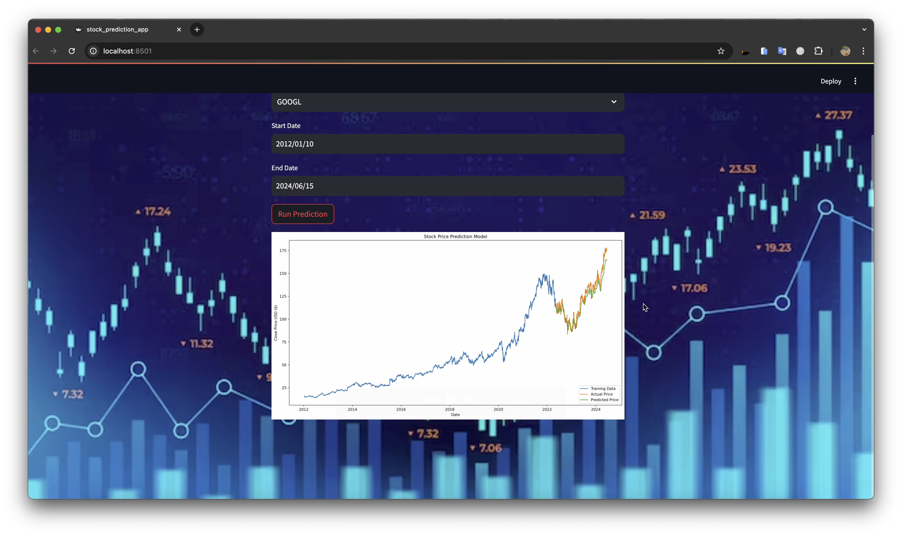

# Stock Price Prediction App

This is a Streamlit application for predicting stock prices using an LSTM (Long Short-Term Memory) neural network. The app fetches stock data using the `yfinance` library, preprocesses the data, trains an LSTM model, and visualizes the predicted stock prices.

## Features

- Fetches historical stock data using `yfinance`
- Preprocesses the data using `MinMaxScaler`
- Trains an LSTM model to predict stock prices
- Visualizes the actual and predicted stock prices using `matplotlib`
- Interactive UI built with Streamlit

## Installation

1. Clone the repository:
   ```sh
   git clone https://github.com/yourusername/stock-price-prediction-app.git
   cd stock-price-prediction-app

2. Create a virtual environment and activate it:
    ```sh
    python3 -m venv venv
    source venv/bin/activate

3. Install the required packages:
    ```sh
    pip install -r requirements.txt

## Usage

1.  Run the Streamlit app:
    ```sh
    streamlit run stock_prediction_app.py

2.  Open your web browser and go to http://localhost:8501 to access the app.

3.  Select a stock symbol from the dropdown, choose the start and end dates, and click the "Run Prediction" button to see the predicted stock prices.

## File Structure
```
.
├── stock_prediction_app.py  # Main application file
├── requirements.txt         # List of required packages
└── README.md                # Project documentation
```
## Requirements
- Python 3.7+
- numpy
- pandas
- yfinance
- scikit-learn
- tensorflow
- streamlit
- matplotlib

## License
This project is licensed under the MIT License. See the LICENSE file for details.

## Author
Developed by Navaneeth


## Screenshots



